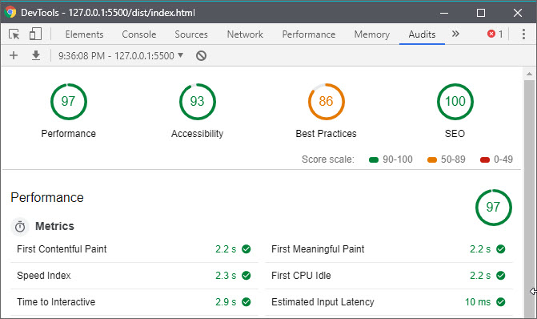
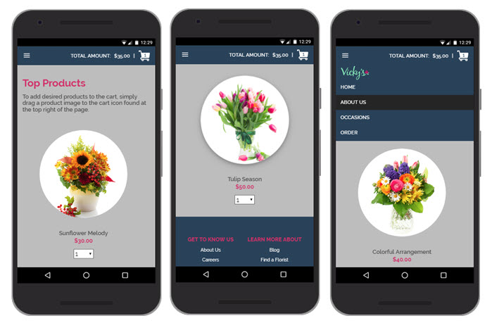
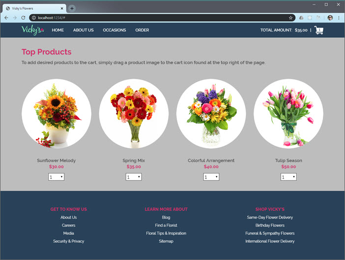

# Vicky's Flowers (React/Redux)

This is a webpage from a fictitious e-commerce site. It was built from the design comp below as part of a take-home test administered by [Stamps.com](Stamps.com).


The completed project has the following features:

- Mobile-ready, fully-responsive design.
- Accessibility tested and ARIA-compliant for use with screen readers and other assistive technology.
- Use of Create-React-App build environment.
- Use of Redux for management of products, cart, & loading state.
- Use of Redux Thunk for Async API calls.

Assignment instructions can be found here:

- [docs/INSTRUCTIONS.md](docs/INSTRUCTIONS.md)

## Installation

Clone the repository.

```bs
git clone https://github.com/james-priest/vickys-flowers-react-redux.git
cd vickys-flowers-react-redux
```

Use yarn or npm to install dependencies.

```sh
yarn

# or

npm install
```

## Usage

### Development mode

- Starts a dev server.
- Bundles but does not optimize or minify.
- Launches website at [http://localhost:3000/](http://localhost:3000/).

```sh
yarn start

# or

npm run start
```

### Production mode

- Will build once (No watch mode or hot module replacement).
- Minifies html, js, css, and optimizes image resources.
- Outputs to `build/`.

```sh
yarn build

# or

npm run build
```

In order to view the production version a local http server needs to be used to launch `dist/index.html` .

Here are two links showing how to spin up a local http server.

- [Simple HTTP Server](http://jasonwatmore.com/post/2016/06/22/nodejs-setup-simple-http-server-local-web-server) - Runs on Node.js.
- [How to run things locally](https://threejs.org/docs/#manual/en/introduction/How-to-run-things-locally) - Instructions for Node.js, Python, & Ruby.

Alternatively, a Visual Studio Code extension can be used to run the site from within the VSCode dev environment.

- [Live Server](https://marketplace.visualstudio.com/items?itemName=ritwickdey.LiveServer) - Launch a development local Server with live reload feature for static & dynamic pages.

## Performance Audit

The site was tested with [Lighthouse](https://developers.google.com/web/tools/lighthouse/) which is found in the Audits tab of Chrome Dev Tools. It was evaluated for the following:

- Performance
- Best Practices
- Accessibility
- SEO



Best practices shows an 86 due to assets being served using HTTP/1 protocol which is what my local dev server uses. This will jump to the 95% range once HTTP/2 is used from a production web server.

## Testing

This webpage was successfully tested on Firefox, Edge, & Chrome.

Safari was not available to test with but transpiling and polyfill settings were configured to target the last two versions of every browser in use with more than 2% market share.

## Screenshots




