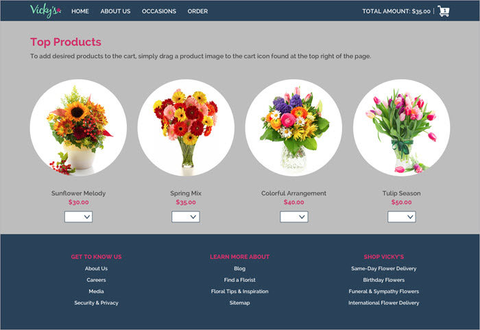

# Instructions

The next step of the interview process is a code test, focusing on HTML, CSS, and JavaScript. Complete it at your own pace, with access to online resources.

I am interested in

- organization
- readability of code
- pixel perfect recreation of the mockup
- as well as the end product

Code comments are encouraged for the JavaScript and structure of the HTML and CSS.

Please include any task runner files that may be used to automate the build process.

## HTML/CSS

You should have received an invitation to the Zeplin project at james-priest@outlook.com

Please convert this Zeplin/Sketch design file into HTML & CSS:
[https://zpl.io/2EXE7yb](https://zpl.io/2EXE7yb)

- It should work on Chrome, Firefox, IE, Edge, and Safari (Mac) browsers.
- Feel free to write the CSS with or without a pre-processor like Sass* or LESS.
- The page should be responsive and you can create your own media queries or use a framework like Bootstrap.
- Only the largest viewport has been provided so use your judgment when arranging the content for smaller devices.
- The grid overlay is not enabled upon opening the Zeplin file, but use it as needed. Toggling “Grid” in the right panel will display a 12 column grid layout to assist with responsive coding.
- Add hover/active states to the navigation and products as you see fit.

Please note, Zeplin provides CSS for selected elements. Reference it as needed to extract values for properties such as **fonts** and **colors**, but I advise against relying on it too heavily. It’s auto-generated and based on how the designer structured the file, which may not correlate with the best approach for semantic mark-up, code structure, or performance.

## JavaScript

- The product images are draggable items.  The cart icon is the drop target.
- At the start of the application, populate every white dropdown/select below a product with a random quantity between 1 and 20.
- The total displayed in the cart will be zero, for both quantity and price.
- When the user drags and drops a product image onto the cart icon, add the quantity and keep a running total of all the items and amount added to the cart.
  - For example, say the total quantity is 2 and total price is $70.00. When a user drops a product with quantity 5 and price $35.00, then the total quantity becomes 7 and the total price becomes $245.00.
- After each successful drop, resets the quantities for every product with a new set of random numbers.
- If the user misses the cart icon when letting go of drag, then the product image snaps back to the starting location and there is no other change.
- Touch events do not need to be considered for purposes of this exercise. The draggable requirements will be evaluated on desktop in the browsers listed in the HTML/CSS section.
- Feel free to use a JavaScript library, framework and any plugins.  (E.g. Angular, etc.)

When the test is completed, please zip the files and return them to me.

Our exchange server will strip the attachment if returned via e-mail, so please provide these via a service such as Dropbox, Google Drive, or Github.
